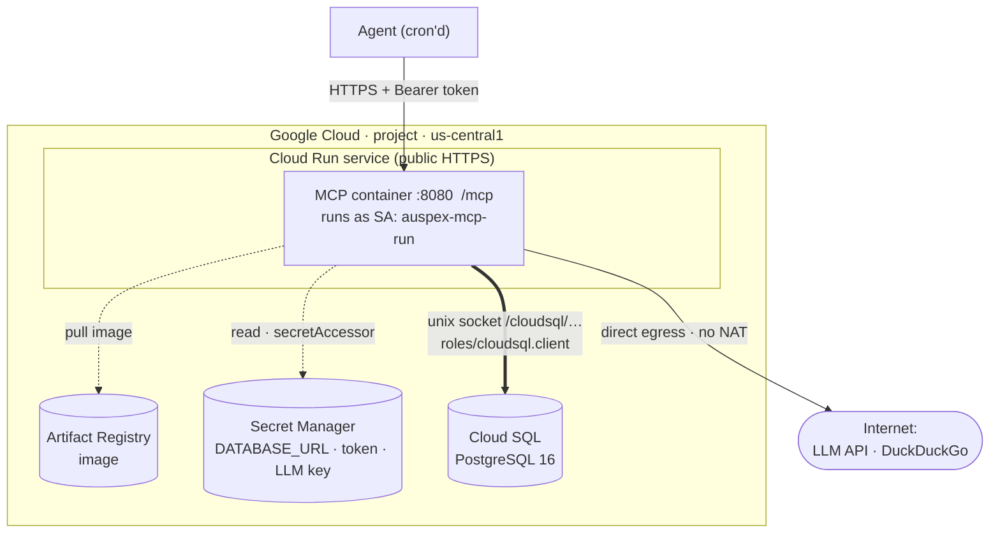

# Auspex MCP server — hosted architecture (GCP Cloud Run)

Architecture of the deployment defined in this folder. The design in
[ADR 0004](../docs/adr/0004-host-mcp-server-on-aws-postgres.md) targeted AWS App
Runner; it was ported to **Cloud Run** to avoid the ~$32/mo NAT gateway App
Runner needs to reach both a private database and the internet. See
[infra/README.md](README.md) for the runbook.

## Request flow

1. The agent calls `https://<service_url>/mcp` with `Authorization: Bearer <token>`.
2. Cloud Run runs the container and terminates TLS (managed cert).
3. At startup the container read its config from **Secret Manager** (the runtime
   service account has `secretAccessor`); the image came from **Artifact Registry**.
4. For job state it connects to **Cloud SQL** over a unix socket the connector
   mounts at `/cloudsql/<connection_name>` — authenticated by `cloudsql.client`.
5. For research it calls the **internet** (LLM API, DuckDuckGo) — **directly**,
   no NAT gateway.

## Networking — the simplification

This is where Cloud Run beats App Runner for this workload: **there is no VPC,
no security groups, no VPC connector, and no NAT gateway** (the whole AWS
`network.tf` is gone).

- **Outbound internet is direct.** Cloud Run instances reach the internet by
  default, so the LLM-API and DuckDuckGo calls "just work" — the exact thing that
  forced a paid NAT gateway on App Runner.
- **Cloud SQL via a socket.** Cloud Run links to the database by its *connection
  name* and mounts an authenticated, encrypted unix socket at
  `/cloudsql/<connection_name>`. The container connects with psycopg2 using
  `host=/cloudsql/<connection_name>` (that's why `DATABASE_URL` has no host:port).
  No private network to wire up.
- **The DB has a public IP** (`ipv4_enabled`) because that's the path the managed
  connector uses — but access still requires IAM (`cloudsql.client`) + the
  database password, so it isn't open to arbitrary clients. Stricter isolation
  (private IP + Serverless VPC Access) is possible but reintroduces VPC
  complexity; the socket path is the simple, standard choice.

## IAM — one identity, granted narrowly

GCP collapses AWS's two-role dance into **one service account** plus a few role
bindings (`iam.tf`).

- **`google_service_account.runtime`** is the identity Cloud Run runs as. GCP
  assumes it implicitly when it's attached to the service — there is **no trust
  policy to author** (contrast AWS, where you write a separate "who may assume
  this role" document for each role).
- It is granted exactly what it needs:
  - **`roles/secretmanager.secretAccessor`** on **each of the three secrets
    individually** — least privilege, not "all secrets in the project."
  - **`roles/cloudsql.client`** — permission to open Cloud SQL connections.
- **Image pull needs no role.** Cloud Run pulls from Artifact Registry in the
  same project via its Google-managed service agent automatically — so unlike
  AWS (which needed a dedicated ECR *access role*), there's nothing to configure.
- **Public endpoint:** by default Cloud Run requires GCP IAM (`run.invoker`) on
  every request. We grant `run.invoker` to **`allUsers`** so the URL is reachable
  — because the app enforces its own `AUSPEX_MCP_TOKEN` bearer auth. So: anyone
  can reach the URL, only a valid token gets in.

### vs the AWS version

| | AWS App Runner | GCP Cloud Run |
|---|---|---|
| Reach the internet | NAT gateway (~$32/mo) | direct, free |
| Reach the database | VPC connector + security groups | unix socket, IAM-authed |
| Identity | 2 roles (trust + permission each) | 1 service account |
| Image pull | dedicated ECR access role | automatic (same-project AR) |
| Networking code | a whole `network.tf` | none |
